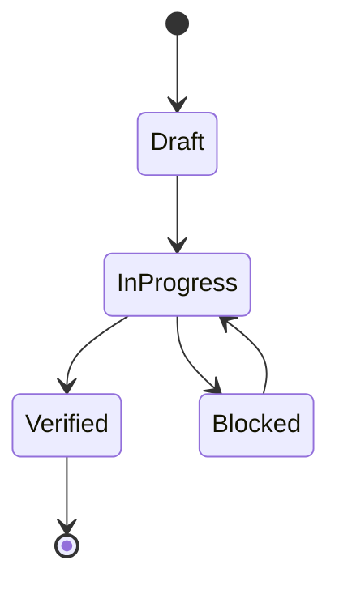

# Semantics

<!-- decapod:capability-overlay:background-processing:start -->

<!-- decapod:capability-overlay:persistent-state:start -->

## Persistent State Semantics Overlay

### Transaction Semantics
- All multi-entity operations MUST be atomic
- Read-after-write consistency within transaction boundaries
- Eventual consistency windows MUST be documented

### Migration Semantics
- Schema migrations MUST be backward-compatible
- Migration rollback procedures MUST be documented
- Data integrity checks post-migration

### Recovery Semantics
- Point-in-time recovery capability
- Recovery objectives MUST be selected for the project and recorded as proof obligations
- Recovery test cadence MUST be selected for the project and recorded as a proof obligation
<!-- decapod:capability-overlay:persistent-state:end -->
## Background Processing Semantics Overlay

### Retry Semantics
- Retry and backoff behavior MUST be selected and documented for each work class
- Poison-work handling MUST be selected and documented for each work class
- Retry MUST preserve the declared side-effect and idempotency semantics

### Idempotency
- Each job MUST declare whether it is idempotent, transactional, compensating, or otherwise duplicate-safe
- Deduplication or compensation mechanisms are project decisions and require proof
- Duplicate execution MUST follow the job's declared duplicate-handling semantics

### Poison Message Handling
- Messages failing after max retries go to dead letter queue
- DLQ MUST be monitored and alerted
- Manual replay capability for DLQ messages
<!-- decapod:capability-overlay:background-processing:end -->
## State Machines

## Invariants
| Invariant | Type | Validation |
|---|---|---|
| No promoted change without proof | System | validation gate |
| Canonical source-of-truth per entity | Data | interface/spec review |
| Mutation events are replayable | Data | deterministic replay |

## Event Sourcing Schema
| Field | Type | Description |
|---|---|---|
| event_id | string | globally unique event id |
| aggregate_id | string | entity/workflow id |
| event_type | string | semantic transition |
| payload | object | transition data |
| recorded_at | timestamp | append time |

## Replay Semantics
- Replay order:
- Conflict resolution:
- Snapshot cadence:
- Determinism proof strategy:

## Error Code Semantics
- Namespace:
- Stable compatibility window:
- Mapping to retry/degrade behavior:

## Domain Rules
- Business rule 1:
- Business rule 2:
- Business rule 3:

## Idempotency Contracts
| Operation | Idempotency Key | Duplicate Behavior |
|---|---|---|
| create/update mutation | request_id | return original result |
| async enqueue | event_id | ignore duplicate enqueue |

## Language Note
- Primary language inferred: JavaScript
